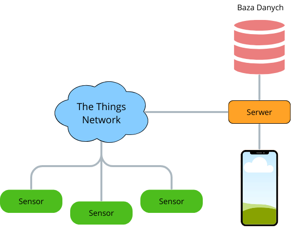
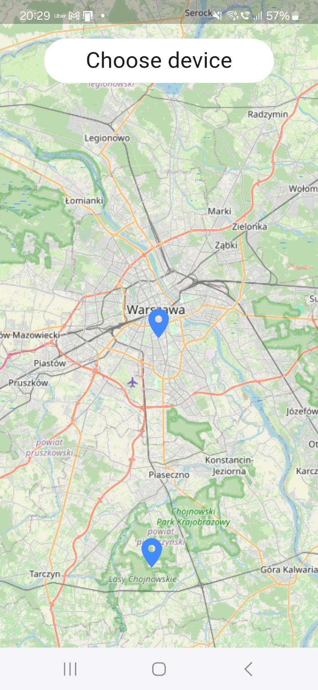
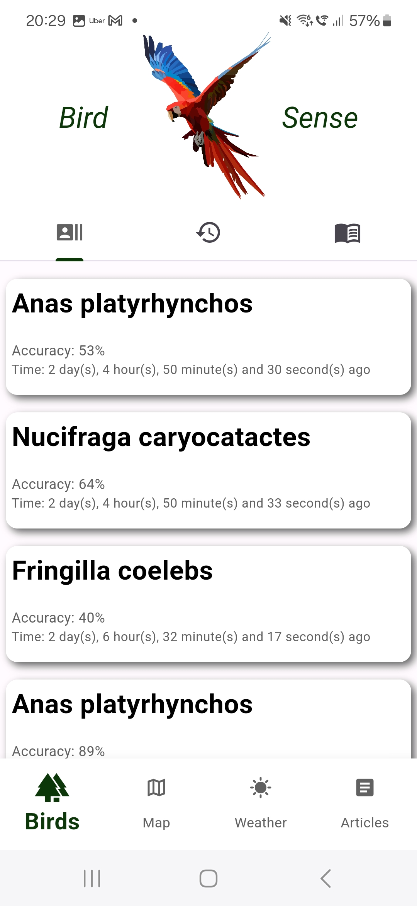
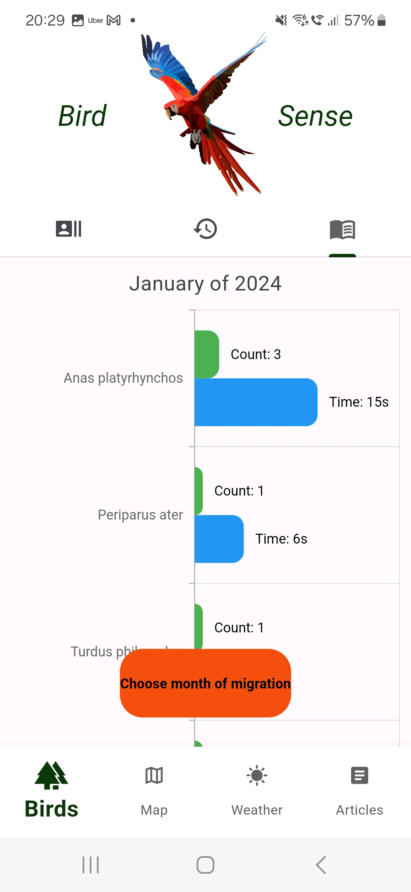
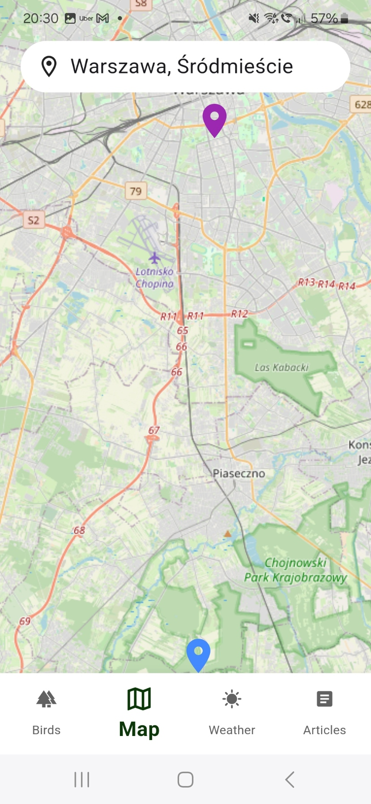
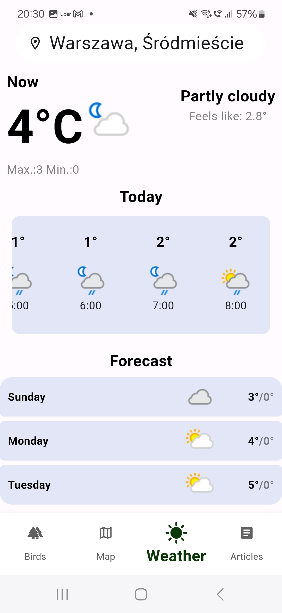
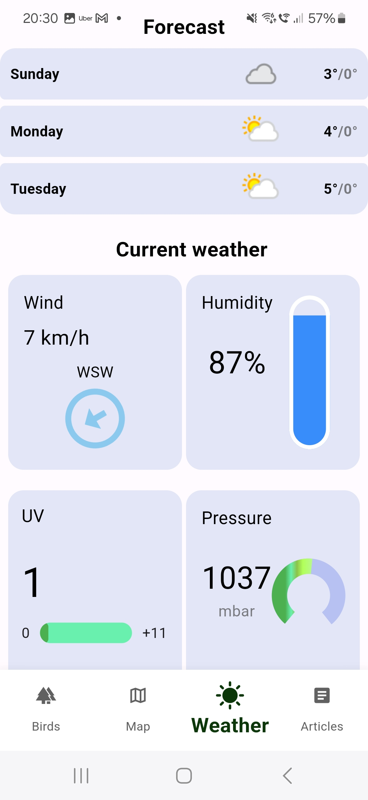
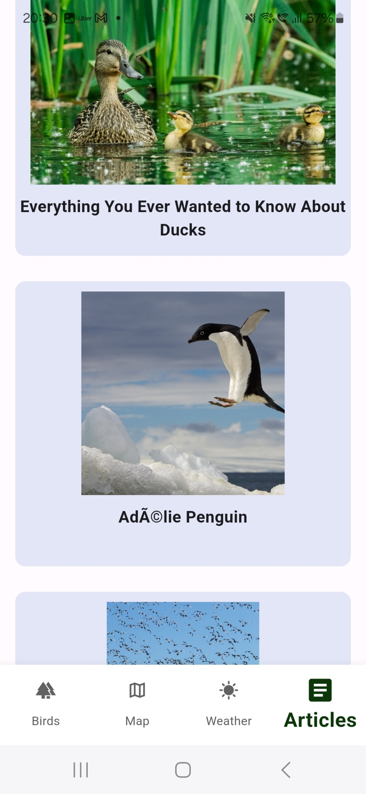

# BirdSense

# Table of Contents

- [About](#about)
- [System Architecture](#system-architecture)
- [Hardware](#hardware)
- [Communication](#communication)
- [Software](#software)
- [Mobile Application](#mobile-application)

# BirdSense
## About
### Problem

Monitoring bird populations currently requires the work of specialists and enthusiasts, which is a time-consuming solution. Additionally, there is a shortage of trained individuals for this task.Our project focuses on implementing a network of sensors to monitor bird species appearing in a specific area during certain periods. The project targets foresters and ornithologists due to its potential applications in monitoring endangered species and observing bird migrations. Furthermore, the solution serves as an excellent tool for hobbyists.

### Our solution

We aim to create a system capable of monitoring bird activity in a designated area without human intervention. Our plan is to develop a network of sensors that record sounds and recognize bird species based on their calls. These sensors will be installed, often by individuals with little experience in similar technologies (e.g., foresters), in areas where bird presence needs to be studied, such as forests, parks, etc. We should consider the possibility of collecting data from sensors located far from populated areas.

### System architecture

Considering the above requirements, we have decided on the following system architecture:
- Sensors: Positioned in the field, these sensors record sound and analyze it to recognize the species of recorded birds.
- Data Transmission: Sensor data is transmitted using the LoRaWAN protocol to a server. We utilize The Things Network.
- Transmitted Data: The transmitted data includes the recognized bird species, the recording end time, and the confidence coefficient.
- Server: The server with a database collects data from sensors and provides it to the application. Communication between the server and both The Things Network and the mobile application is facilitated through a REST API.
- Mobile app: The application enables users to display and analyze data from sensors.

# Hardware
The device records sound and identifies bird species present in it.

The central unit is equipped with a Raspberry Pi as the main processing unit, a microphone, and an atmospheric conditions sensor. Solar panels connected via a solar energy management module serve as the power source. The unit sends data through a LoRa module.

## Central unit
The central unit utilizes a Raspberry Pi as the main processing unit. It provides ample computational power and flexibility for running the necessary algorithms for bird species recognition.

## Microphone
We chose a MEMS microphone due to its miniature size and various interface options. Our project utilizes the $I^2S$ interface on the Raspberry Pi for seamless integration.

## LoRaWAN module
We opted for LoRaWAN communication due to its long-range capabilities and low power consumption. The LoRa-E5 module serves as our LoRaWAN solution.

## Power supply
Currently the device is powered by a USB-C charger.

# Communication

## LoRaWAN
To transmit data from the measurement devices to the server, we use LoRaWAN and HTTP protocols. We opted for LoRaWAN due to its long communication range (up to 15 km) and the ability to utilize a private gateway to extend network coverage, which is crucial as our devices will often be deployed in forests where public network coverage may be lacking.

We connect the devices to The Things Network, which consists of numerous gateways worldwide. This network allows for the attachment of private gateways to expand coverage. Data received from the sensors will be transmitted to our server via the HTTP protocol.

The LoRaWAN protocol allows for sending messages with a maximum size of 242 bytes. We analyze 3-second segments of recordings, and sending a message takes about 7 seconds (regardless of length), so the transmitted messages must be optimized to send the results of analyzing 3 segments at once.

Currently, a single detection message occupies approximately 50 bytes. These messages are generated upon bird detection, not more frequently than every 3 seconds. Messages are concatenated to not exceed the maximum allowed length before transmission.

After sending a message, the device waits for confirmation of receipt. In case of non-receipt, the message is resent. This is crucial because LoRaWAN devices send messages at random times, and there is a high probability that several devices will start transmitting simultaneously, resulting in none of the messages being received.

In the final implementation, we plan to provide users with device configuration options to work with other networks or their own gateway.

# Software

## Raspberry Pi

We developed the software for the measurement device in Python, utilizing the multiprocessing library to ensure concurrency for simultaneous sound recording, analysis, and data transmission.

### BirdNET

For sound analysis, we utilize the convolutional neural network BirdNet created by the Cornell Lab of Ornithology and Chemnitz University of Technology. This solution allows for the recognition of the largest number of bird species worldwide with high accuracy.

## The Things Network
We developed a custom TTN payload formatter to convert binary data to JSON format used in our REST API.

## Server

### Fast API

We use a server programmed in Python using the FastAPI framework. We utilize an SQLite database for storage. Communication with the server follows REST API standards.

Sensors can connect to our server (most likely, we would utilize some cloud-based solution) or with users' private devices (we would provide server software).

### Database

We utilize an SQLite database consisting of three tables: detections, devices, and users.

To identify the measurement device, we use the unique devEUI number of the LoRaWAN module. From the measurement devices to the server, we only transmit the end time of the recording, while the start time is calculated based on the known constant recording time. In case of multiple detections of the same bird species in a short period, the end time is updated, and the confidence is calculated using a moving average formula. This solution reduces the amount of stored data and speeds up data retrieval from the database.

# Mobile Application

For displaying data, we use a mobile application. This solution is aimed at users of our device who can easily access data while in the middle of the forest.

The application is programmed in Dart using the Flutter framework. Communication between the application and the server occurs via HTTP protocol following the REST API software architecture style.

Upon entering the application, a map is displayed with the option to select the device from which we want to view birds. The device name, end-device identifier (devEUI), and device location (longitude and latitude) are stored on the server and fetched to the application.

After selecting the device, the application displays a page with birds. On the first page, the latest detected birds are displayed. The accuracy of detection and differences in time from bird detection to the present are also shown. The entire list stored on the server is not displayed; only a portion of it is shown. When scrolling down the list, it can be expanded, changing the time value for observing birds during the query.

Subsequent pages display charts showing the number of detected birds and the total time birds were heard. On one page, the charts can be displayed based on the month, and on the next page, based on recent history.

Device selection can also be changed. The selected device is displayed in a different color, and the device location name is shown.

Depending on the selected device and its location, weather information is displayed on the next page. An internet weather server, weatherapi.com, is used for this purpose. Current weather conditions, as well as hourly and multi-day forecasts, are displayed.

The last and most interesting page is the articles page. Interesting facts are fetched from a server where only selected articles are stored.

